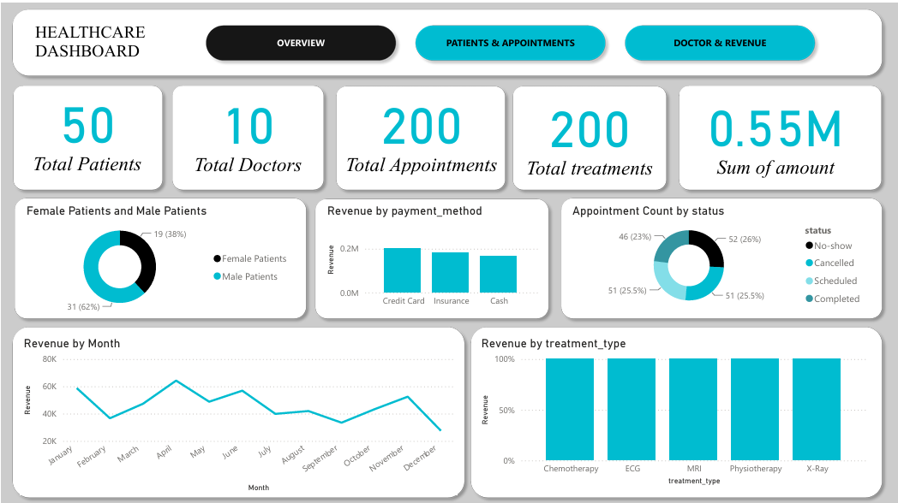
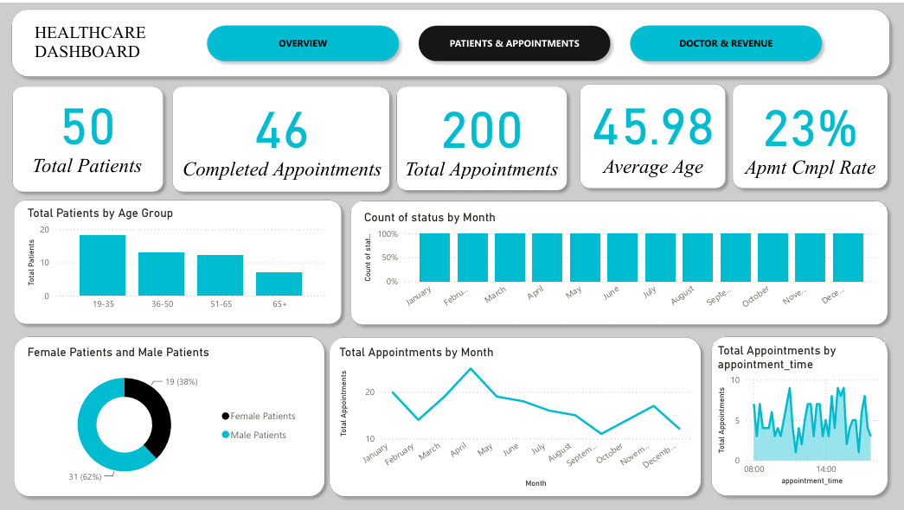
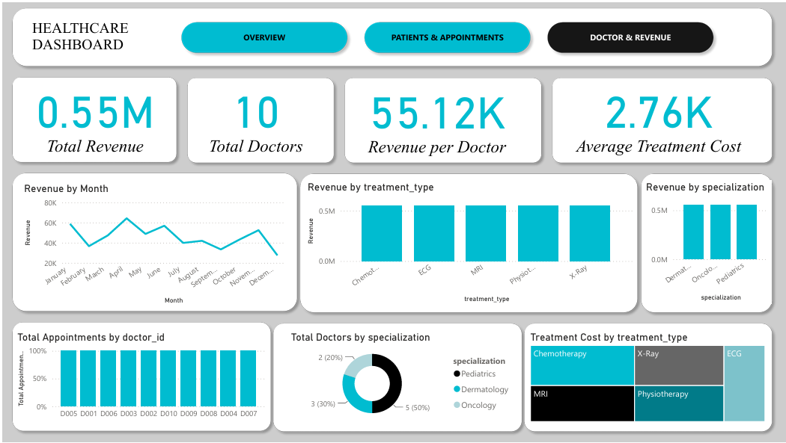

# Healthcare Analytics Dashboard

## Project Overview

This project is an interactive Healthcare Analytics Dashboard developed using Power BI.

The dashboard provides insights into:

- Patient demographics
- Appointment analytics
- Doctor performance
- Revenue analysis
- Treatment trends

## Tools Used

- Power BI
- Power Query
- DAX
- Data Modeling

## Dashboard Pages

### Executive Overview

### Patients & Appointments Analytics

### Doctors & Revenue Analytics

## Key Skills Demonstrated

- Data Cleaning
- Data Transformation
- DAX Measures
- Dashboard Design
- Business Intelligence

## Dataset

Hospital Management Dataset from Kaggle.